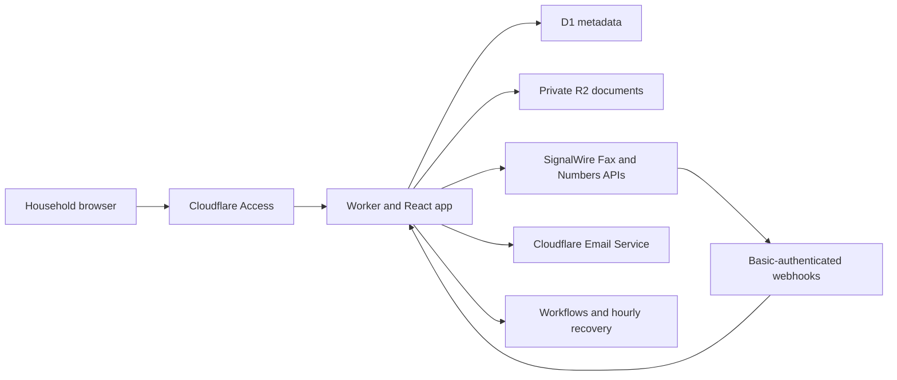

# Family Fax

Family Fax is a self-hosted web app for the occasional office that still requires a fax. One household opens a fax line, uses it for sending and receiving, and controls the line's billing lifecycle from the app.

SignalWire is the recommended production provider. A no-charge demo provider supports local development and end-to-end tests. An optional Sinch adapter supports existing deployments.

## Features

- Mobile-first send, receive, archive, activity, and fax-line controls
- Browser-side cover sheets, image conversion, PDF merge, preview, and SHA-256 digests
- Near-real-time email confirmations for received and successfully delivered faxes
- Private Cloudflare D1 metadata and R2 document storage
- Durable number and fax workflows with hourly recovery
- Correlated event timelines, raw provider artifacts, health checks, and deployment metadata
- Cloudflare Access authentication and narrowly routed provider webhooks
- Explicit price confirmation before paid provider actions
- No automatic replay after an ambiguous fax submission

## Run the demo

Requirements: Node.js 22.12 or newer.

```sh
npm ci
npm run db:migrate:local
npm run dev
```

Open <http://127.0.0.1:5173>. Demo mode cannot contact a live fax provider or create provider charges.

Populate a receiving line and an incoming fax while the development server is running:

```sh
npm run demo:seed
```

## Verify the project

```sh
npm run verify
npx playwright install chromium
npm run test:e2e
```

The browser suite uses an isolated, demo-only Wrangler configuration. A preflight aborts the suite unless the running app reports the demo provider. The suite covers desktop and mobile household journeys, the default `+1` country code, successful and failed sends, incoming archival, email confirmations, ambiguous provider results, diagnostics, and number lifecycle controls.

## Architecture



Production uses Cloudflare Workers, static assets, Access, D1, R2, Workflows, Cron, and Email Service. SignalWire handles fax-capable numbers and fax delivery.

Start with [Self-hosting](docs/SELF_HOSTING.md), then follow [SignalWire setup](docs/SIGNALWIRE_SETUP.md). [Operations](docs/OPERATIONS.md) covers monitoring and recovery. [Privacy and compliance](docs/PRIVACY_AND_COMPLIANCE.md) explains the sensitive-data boundary.

## Configuration

Committed defaults use `FAX_PROVIDER=demo` and `AUTH_MODE=dev`. Copy the templates for a private deployment:

```sh
cp .env.production.example .env.production
cp .wrangler.production.example.jsonc .wrangler.production.jsonc
```

The ignored copies hold all account, hostname, email, pricing, and provider values. Important controls include:

| Variable | Purpose |
| --- | --- |
| `DEFAULT_PHONE_COUNTRY` | Country selector default, `US` by default |
| `PREFERRED_AREA_CODES` | Ordered local-number search preference |
| `DEFAULT_RENTAL_MONTHS` | Initial scheduled line term |
| `SIGNALWIRE_LOCAL_NUMBER_MONTHLY_PRICE` | Operator-confirmed price estimate shown before purchase |
| `SIGNALWIRE_MINIMUM_NUMBER_HOLD_DAYS` | Provider release hold for the current account |
| `MAX_EMAIL_ATTACHMENT_BYTES` | Largest fax PDF attached to a confirmation email |
| `DEFAULT_RETENTION` | `forever`, the supported release policy |

See [.env.production.example](.env.production.example) for the complete list.

## Billing boundary

SignalWire number rental and fax usage create provider charges. Family Fax displays the configured monthly number estimate and asks for confirmation before purchase. SignalWire owns billing and release eligibility. Family Fax schedules its own release requests and verifies provider state.

Cloudflare has separate account limits and terms for Workers, D1, R2, Workflows, and Email Service. Review the current provider pages before deployment:

- [Workers pricing](https://developers.cloudflare.com/workers/platform/pricing/)
- [D1 pricing](https://developers.cloudflare.com/d1/platform/pricing/)
- [R2 pricing](https://developers.cloudflare.com/r2/pricing/)
- [Workflows limits](https://developers.cloudflare.com/workflows/reference/limits/)
- [Cloudflare Email Service](https://developers.cloudflare.com/email-service/)
- [SignalWire Fax pricing](https://signalwire.com/pricing/fax)
- [SignalWire phone-number API](https://signalwire.com/docs/apis/rest/phone-numbers)

## Safety defaults

- Development authentication accepts localhost requests only.
- Production deployments require Cloudflare Access.
- Paid actions require an explicit confirmation of the displayed quote.
- A number rental records the selected candidate before the provider mutation and never rents a replacement automatically.
- An uncertain fax submission becomes `status_unknown` and is never replayed automatically.
- The selected household line is reused without changing its release schedule.
- The Fax line page owns number search, purchase, renewal, release, and provider diagnostics.
- R2 remains private. Authenticated app downloads and expiring single-document provider tokens are the only document reads.
- Fax metadata and provider payloads are retained in full. The audit boundary removes credential-bearing fields.

Never deploy real documents with `AUTH_MODE=dev`.

## Project layout

```text
src/client        React interface and browser PDF preparation
src/domain        Configuration, validation, and state machines
src/providers     Demo, SignalWire, and optional Sinch adapters
src/server        API, auth, repositories, storage, and services
src/worker        Cloudflare entry point, Workflows, and recovery sweep
migrations        D1 schema
e2e               Desktop and mobile household journeys
docs              Deployment, operations, privacy, and verification
```

## Provider testing boundary

The SignalWire adapter has request, response, callback, credential-scope, and lifecycle contract tests. SignalWire does not provide shared fake fax credentials or a fax sandbox. The first production operator must complete a controlled live smoke test with synthetic documents and their own account. The procedure is in [SignalWire setup](docs/SIGNALWIRE_SETUP.md).

## Contributing and security

Read [CONTRIBUTING.md](CONTRIBUTING.md) before opening a pull request. Use [GitHub private vulnerability reporting](https://github.com/drewburchfield/family-fax/security/advisories/new) for security issues. Never include real fax content, medical information, credentials, account identifiers, phone numbers, email addresses, or deployment domains in public reports.

## License

MIT. See [LICENSE](LICENSE).
